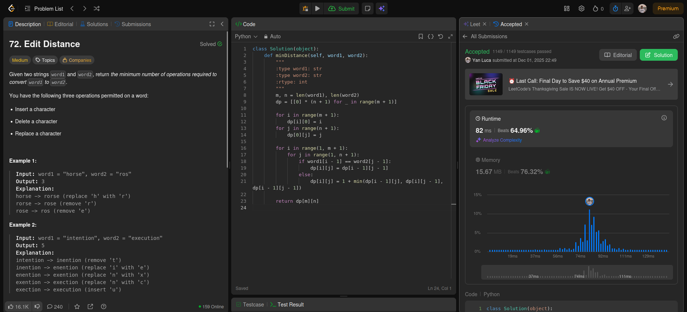
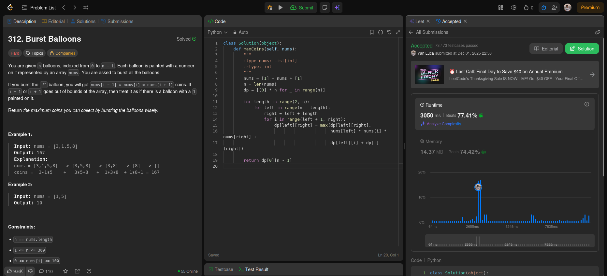

## Alunos
Lucas Antunes de Avelar - 200067095

Yan Luca Viana de Araújo Fontenele - 211031889
## Questões 

## [Edit Distance](https://leetcode.com/problems/edit-distance/description/)

## [Burst Balloons](https://leetcode.com/problems/burst-balloons/description/)

## [Dungeon Game](https://leetcode.com/problems/dungeon-game/submissions/1844588904/?utm_source=chatgpt.com)

## [Shortest Path Visiting All Nodes](https://leetcode.com/problems/palindrome-partitioning-ii/submissions/1844588630/?utm_source=chatgpt.com)

# Vídeo explicativo

